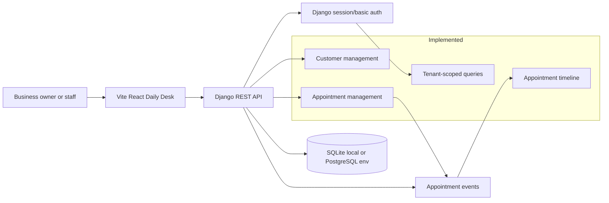

# Confirmly Documentation

This folder documents the implementation that exists in the repository today and separates it from the remaining MVP work described in `requirements/requirements.md`.

## Documents

- [Implementation review](implementation-review.md) — current completion status, implemented scope, gaps, and suggested next slices.
- [Schemas](schemas.md) — current domain model, API payloads, and planned schema extensions.
- [Workflows](workflows.md) — implemented and planned user/system workflows.
- [Designs](designs.md) — current architecture and frontend/backend design notes.
- [Processes](processes.md) — local development, CI, release, testing, and operational processes.

## Current implementation snapshot

## Status summary

The repository currently implements the foundation slice of the product:

- Django project, REST framework, business signup, auth permissions, pagination, and tenant scoping.
- Business, customer, appointment, and appointment-event models.
- Business owner signup that creates a Django user and linked business.
- Customer and appointment REST APIs with search/filter/order support.
- Appointment create/update event recording.
- React daily desk UI for login, customer creation, appointment creation, list views, metrics, search/filter, and timeline viewing.
- Docker Compose, Makefile commands, and CI for security scan, backend checks/tests, and frontend build.

Major MVP items still pending:

- Appointment lifecycle actions for confirm, cancel, complete, and no-show.
- Reminder logs, Celery/Redis jobs, reminder delivery, retry/idempotency behavior.
- Signed public customer action links.
- Risk scoring models, engine, persisted assessments, and dashboard risk metrics.
- OpenAPI documentation, production deployment hardening, and richer role-based permissions.
