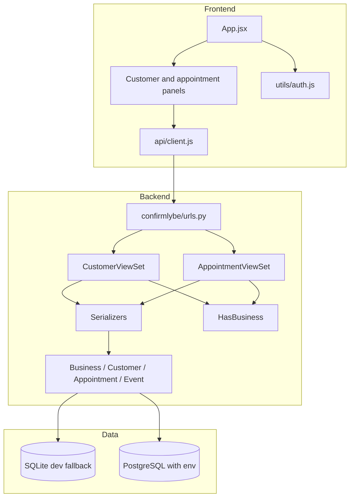
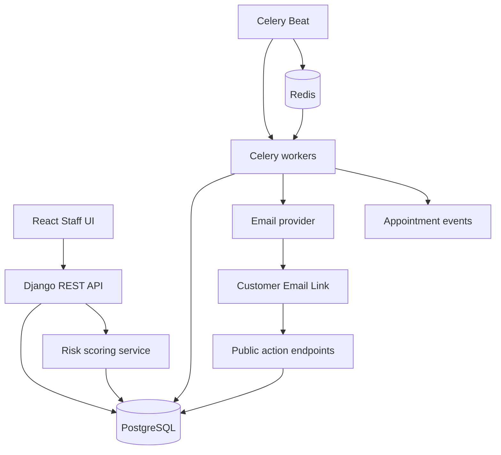

# Designs

## Product design state

The implemented product is currently a staff-facing daily desk:

- sign in with a Django user;
- create a new business owner account;
- view basic metrics;
- create/search customers;
- create/search/filter appointments;
- inspect an appointment timeline.

The intended MVP product is broader:

- automated reminders;
- customer one-click actions;
- explainable no-show risk;
- revenue-at-risk and attendance dashboards.

## Current system design



## Backend design notes

### Tenant isolation

Tenant isolation is implemented at the viewset queryset layer:

- customers are filtered by `business=request.user.business`;
- appointments are filtered by `business=request.user.business`;
- cross-tenant detail access returns `404`.

The `HasBusiness` permission rejects authenticated users without a related business.

### Event design

`AppointmentEvent` is append-only by convention. Current code writes events from serializer create/update hooks.

This is adequate for the current slice. For lifecycle, reminders, and risk scoring, prefer moving event-producing logic into service functions so each business operation has one transactional boundary.

Recommended service shape:

```text
appointments/services.py
  create_appointment(...)
  update_appointment(...)
  transition_appointment(...)
  record_event(...)

reminders/services.py
  send_reminder(...)
  build_reminder_email(...)

risk/services.py
  calculate_risk(...)
  persist_risk_assessment(...)
```

### API design

Current API resources:

```text
/api/customers/
/api/customers/{id}/
/api/businesses/signup/
/api/appointments/
/api/appointments/{id}/
/api/appointments/{id}/timeline/
```

Suggested next API resources:

```text
/api/appointments/{id}/confirm/
/api/appointments/{id}/cancel/
/api/appointments/{id}/complete/
/api/appointments/{id}/no-show/
/api/appointments/{id}/risk/
/api/dashboard/summary/
/public/appointments/{signed_token}/confirm/
/public/appointments/{signed_token}/cancel/
```

## Frontend design notes

Current frontend state is centralized in `App.jsx`. That is acceptable for this stage, but it will become hard to maintain once lifecycle actions, risk panels, reminders, and dashboards are added.

Suggested next frontend organization:

```text
src/
  api/
    client.js
  features/
    appointments/
      hooks.js
      components...
    customers/
      hooks.js
      components...
    dashboard/
      DashboardPanel.jsx
    risk/
      RiskBadge.jsx
      RiskReasons.jsx
  state/
    auth.js
```

## Planned full MVP architecture



## Design principles for remaining work

- Keep tenant scoping server-side. Do not trust frontend-provided business IDs.
- Use explicit lifecycle endpoints instead of generic status PATCH.
- Store immutable events for every externally meaningful action.
- Make reminders idempotent using a database uniqueness constraint.
- Persist risk assessments; do not compute risk only transiently for display.
- Keep public customer action endpoints narrow and signed.
- Treat dashboard values as backend aggregates, not frontend calculations over a paginated list.
