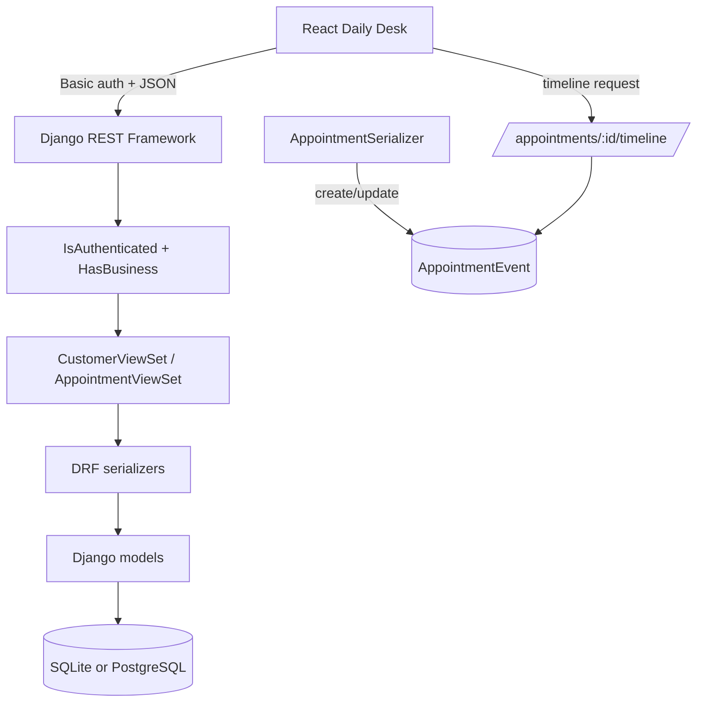
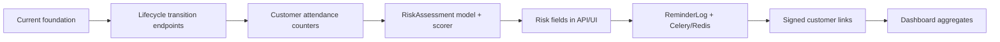

# Implementation Review

## Executive summary

Confirmly is partially implemented. The current codebase is a solid foundation for the MVP, but it is not yet a reminder/risk-scoring product. It currently supports authenticated, tenant-scoped customer and appointment management with immutable appointment-event timelines and a working React desk UI.

Estimated implementation against the full MVP in `requirements/requirements.md`: **about 35–40%**.

| Area | Status | Notes |
|---|---:|---|
| Django project setup | Implemented | Settings, URLs, installed apps, REST framework config, SQLite/PostgreSQL switching. |
| Multi-tenant business ownership | Mostly implemented | `Business.owner` is one-to-one with Django user; permissions require a business. Staff roles are not implemented. |
| Customer CRUD | Mostly implemented | API supports tenant-scoped create/list/detail/update/delete through `ModelViewSet`; frontend supports create/list/search. |
| Appointment CRUD | Partially implemented | API supports list/create/retrieve/patch; delete disabled; frontend supports create/list/search/filter/timeline. |
| Appointment status lifecycle | Minimal | Status exists but is read-only through serializer. No confirm/cancel/complete/no-show actions yet. |
| Appointment event timeline | Partially implemented | Created/updated events are recorded and exposed. Lifecycle/reminder/risk events are not produced yet. |
| Email reminders | Not implemented | No reminder models, Celery tasks, scheduler, provider integration, or idempotency boundary. |
| Signed customer action links | Not implemented | No public confirmation/cancellation endpoints or token model/signing service. |
| Risk scoring | Not implemented | No risk assessment model, rule engine, persisted score, reasons, or recommended actions. |
| Dashboard metrics | Basic frontend only | UI computes count, pending count, and scheduled value from paginated appointment response. Backend aggregate metrics are not implemented. |
| Frontend | Partially implemented | Daily desk UI exists for core records. No risk/reminder/lifecycle screens yet. |
| Testing | Partial but meaningful | Backend tests cover tenant isolation, validation, events, and permissions. No frontend tests. |
| CI | Implemented | Security scan, commit message style, backend format/lint/check/test, frontend format/build. |
| Deployment/runtime | Partial | Dockerfile and Compose exist. Production-grade static handling, secrets, email, workers, and scheduler are not complete. |

## Implemented behavior

### Backend

- Uses Django and Django REST Framework.
- Supports Django user authentication with session and basic auth.
- Requires authenticated users to have a related `Business`.
- Scopes customer and appointment querysets to `request.user.business`.
- Defines:
  - `Business`
  - `Customer`
  - `Appointment`
  - `AppointmentEvent`
- Enforces unique customer email per business at model and serializer layers.
- Normalizes customer email to lowercase.
- Validates appointment creation:
  - customer must belong to the authenticated business;
  - scheduled time must be in the future on create;
  - duration must be positive;
  - service price cannot be negative.
- Records appointment events:
  - `created` when an appointment is created;
  - `updated` when editable appointment fields change.
- Exposes appointment timeline through `/api/appointments/{id}/timeline/`.

### Frontend

- Uses Vite, React, and `lucide-react`.
- Stores basic-auth credentials in browser storage through the auth utility.
- Loads customers and appointments after login.
- Supports:
  - customer search and creation;
  - appointment search, status filter, creation, and timeline drawer;
  - simple desk metrics for customer count, pending count, and scheduled value.

### Tooling

- Docker Compose includes:
  - PostgreSQL;
  - Django web service;
  - Vite frontend service.
- Makefile wraps common Compose commands.
- CI includes:
  - gitleaks secret scan;
  - Conventional Commit subject validation;
  - Python lint/format checks;
  - Django checks/tests;
  - frontend Prettier check and Vite build.

## Current architecture

## Key gaps before MVP

1. Appointment lifecycle transitions
   - Add explicit actions/endpoints for confirm, cancel, complete, and no-show.
   - Update customer attendance counters and timestamps transactionally.
   - Emit lifecycle events.

2. Reminder subsystem
   - Add `ReminderLog` model.
   - Add Celery, Celery Beat, and Redis configuration.
   - Implement 24-hour and 2-hour reminder discovery tasks.
   - Add provider abstraction and retry behavior.
   - Use database uniqueness as the idempotency boundary.

3. Public signed customer links
   - Generate signed, expiring confirm/cancel links.
   - Add unauthenticated public endpoints that validate tokens.
   - Ensure idempotent behavior for repeated clicks.

4. Risk scoring
   - Add `RiskAssessment` model.
   - Implement rule-based scoring service.
   - Persist reasons, input snapshot, recommendation, score, level, and rules version.
   - Surface score/reasons on appointment list/detail and dashboard.

5. Dashboard metrics
   - Add backend aggregate endpoints instead of computing metrics only from the current page of appointments.
   - Include revenue at risk, high-risk appointment count, attendance rates, and reminder performance.

6. Documentation/API contract
   - Add OpenAPI generation.
   - Document auth behavior, errors, pagination, and lifecycle actions.

## Suggested next implementation slices

Recommended order:

1. Lifecycle transitions, because reminders and risk both depend on reliable status history.
2. Customer attendance history updates, because risk scoring needs those inputs.
3. Risk assessment storage and synchronous scoring on appointment create/update.
4. Reminder logs and background workers.
5. Public signed links and customer actions.
6. Dashboard aggregate endpoints and UI.

## Risks and technical concerns

- The frontend metrics use the currently loaded appointment page, not all tenant appointments.
- `Appointment.status` is currently read-only, so staff cannot complete the lifecycle through the API.
- There is no frontend test suite.
- Dockerfile installs development dependencies into the app image.
- Production serving for the frontend/static files is not defined.
- No CORS/proxy documentation is present for local Vite-to-Django requests.
- Reminder and risk event enum values exist before the producing systems exist; that is acceptable, but docs and UI should not imply those events are active yet.
