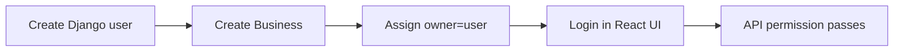
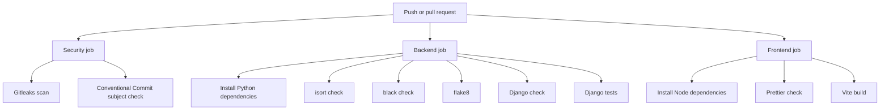
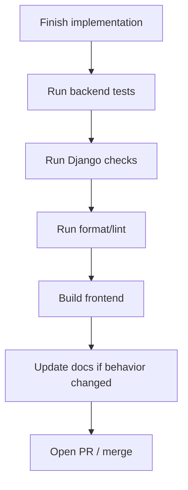

# Processes

## Local development

### Backend with Python directly

```bash
python3 -m venv .venv
source .venv/bin/activate
pip install -r requirements.txt -r requirements-dev.txt
python manage.py migrate
python manage.py createsuperuser
python manage.py runserver
```

### Docker Compose

```bash
make build
make run
```

Useful Make targets:

```bash
make help
make m
make mm
make test
make check
make format
make pretty
make logs
make stop
```

## Required local data setup

The frontend expects a Django user that has a related `Business`.

Minimum setup:

1. Run migrations.
2. Create a superuser.
3. Create a `Business` in Django admin and set its owner to that user.
4. Sign in through the frontend with that Django username and password.



## Testing process

Backend:

```bash
python manage.py test
```

or:

```bash
make test
```

Current backend tests cover:

- tenant-scoped customer listing;
- cross-tenant customer detail protection;
- customer creation business assignment;
- duplicate email behavior across businesses;
- user-without-business permission denial;
- appointment creation and created event recording;
- cross-tenant appointment protection;
- appointment past-time validation;
- update event recording;
- timeline tenant scoping.

Frontend:

```bash
cd frontend
npm install
npm run build
```

There is no frontend test suite currently.

## CI process



## Commit process

CI enforces Conventional Commit-style subjects:

```text
type(optional-scope): short summary
```

Allowed types:

- `feat`
- `fix`
- `docs`
- `style`
- `refactor`
- `test`
- `chore`
- `ci`
- `build`
- `perf`

Examples:

```text
feat(appointments): add lifecycle transition endpoints
docs: add implementation review
fix(customers): normalize duplicate email validation
```

## Suggested release checklist

Before merging or releasing a meaningful change:



Commands:

```bash
make test
make check
make format
cd frontend && npm run build
```

## Operational processes still needed

These are not implemented yet but should exist before production use:

- secret rotation and environment management;
- database backup and restore;
- structured application logging;
- error reporting;
- Celery worker and scheduler supervision;
- email provider bounce/failure handling;
- reminder replay/retry policy;
- public link expiry policy;
- migration rollback strategy;
- production static/frontend serving strategy.
