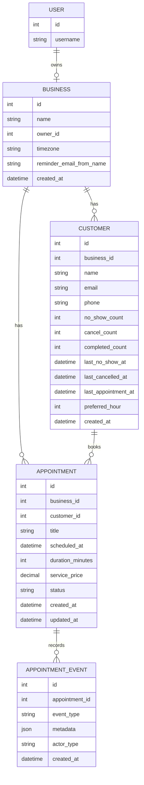
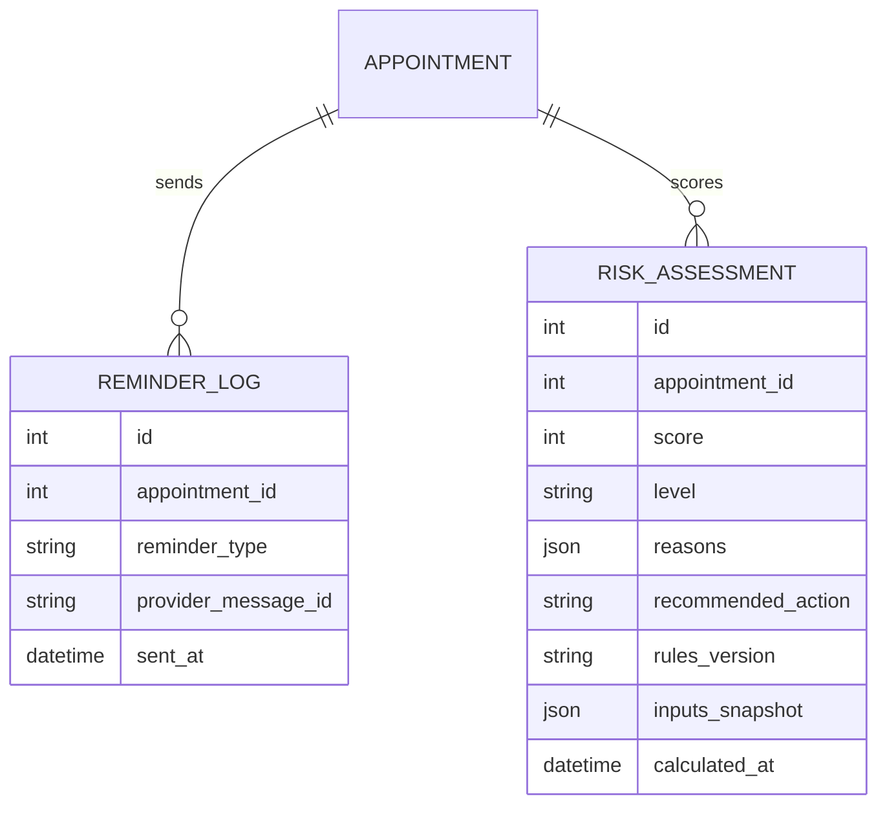

# Schemas

## Current entity relationship diagram



## Current models

### Business

| Field | Type | Required | Notes |
|---|---|---:|---|
| `id` | BigAutoField | Yes | Primary key. |
| `name` | CharField(150) | Yes | Business display name. |
| `owner` | OneToOneField(User) | Yes | One business per owner user. |
| `timezone` | CharField(64) | Yes | Defaults to `America/New_York`. |
| `reminder_email_from_name` | CharField(120) | No | Exists before reminder subsystem is implemented. |
| `created_at` | DateTime | Yes | Auto-created. |

### Customer

| Field | Type | Required | Notes |
|---|---|---:|---|
| `id` | BigAutoField | Yes | Primary key. |
| `business` | ForeignKey(Business) | Yes | Tenant owner. |
| `name` | CharField(120) | Yes | Customer name. |
| `email` | EmailField | Yes | Unique per business. Serializer lowercases values. |
| `phone` | CharField(30) | No | Optional. |
| `no_show_count` | PositiveInteger | Yes | Reserved for lifecycle/risk features. |
| `cancel_count` | PositiveInteger | Yes | Reserved for lifecycle/risk features. |
| `completed_count` | PositiveInteger | Yes | Reserved for lifecycle/risk features. |
| `last_no_show_at` | DateTime | No | Reserved for lifecycle/risk features. |
| `last_cancelled_at` | DateTime | No | Reserved for lifecycle/risk features. |
| `last_appointment_at` | DateTime | No | Reserved for lifecycle/risk features. |
| `preferred_hour` | PositiveSmallInteger | No | Reserved for risk/personalization. |
| `created_at` | DateTime | Yes | Auto-created. |

Constraint:

- `unique_customer_email_per_business` on `business + email`.

### Appointment

| Field | Type | Required | Notes |
|---|---|---:|---|
| `id` | BigAutoField | Yes | Primary key. |
| `business` | ForeignKey(Business) | Yes | Tenant owner, assigned from authenticated user. |
| `customer` | ForeignKey(Customer) | Yes | Must belong to same business. |
| `title` | CharField(150) | Yes | Appointment title. |
| `scheduled_at` | DateTime | Yes | Must be future on create. |
| `duration_minutes` | PositiveInteger | Yes | Must be greater than zero. |
| `service_price` | Decimal(10,2) | Yes | Must be zero or greater. |
| `status` | CharField | Yes | Defaults to `pending`; read-only through current API serializer. |
| `created_at` | DateTime | Yes | Auto-created. |
| `updated_at` | DateTime | Yes | Auto-updated. |

Statuses:

- `pending`
- `confirmed`
- `cancelled`
- `completed`
- `no_show`

Indexes:

- `business, scheduled_at`
- `business, status, scheduled_at`

### AppointmentEvent

| Field | Type | Required | Notes |
|---|---|---:|---|
| `id` | BigAutoField | Yes | Primary key. |
| `appointment` | ForeignKey(Appointment) | Yes | Parent appointment. |
| `event_type` | CharField | Yes | Enum value. |
| `metadata` | JSONField | Yes | Defaults to `{}`. |
| `actor_type` | CharField(30) | Yes | Defaults to `system`; create/update use `staff`. |
| `created_at` | DateTime | Yes | Auto-created. |

Event types defined:

- `created`
- `updated`
- `reminder_24h_sent`
- `reminder_2h_sent`
- `reminder_failed`
- `reminder_opened`
- `confirmed`
- `cancelled`
- `completed`
- `no_show`
- `risk_calculated`

Currently produced by code:

- `created`
- `updated`

## Current API schemas

Most current business APIs require authentication and a related `Business`.
The signup endpoint is public so a new owner can create the initial business.

### Business signup request

```json
{
  "business_name": "Northside Studio",
  "username": "northside",
  "email": "owner@example.com",
  "password": "safe-test-pass",
  "timezone": "America/New_York"
}
```

### Business signup response

```json
{
  "user": {
    "id": 1,
    "username": "northside",
    "email": "owner@example.com"
  },
  "business": {
    "id": 1,
    "name": "Northside Studio",
    "timezone": "America/New_York"
  }
}
```

### Create business for current authenticated user

```json
{
  "name": "Existing Owner Studio",
  "timezone": "America/Chicago"
}
```

Response:

```json
{
  "id": 1,
  "name": "Existing Owner Studio",
  "timezone": "America/Chicago",
  "created_at": "2026-07-14T10:00:00Z"
}
```

Notes:

- Requires authentication.
- Does not require the user to already have a business.
- Rejects users who already have a business.

### Customer response

```json
{
  "id": 1,
  "name": "Alice",
  "email": "alice@example.com",
  "phone": "555-0100",
  "no_show_count": 0,
  "cancel_count": 0,
  "completed_count": 0,
  "last_no_show_at": null,
  "last_cancelled_at": null,
  "last_appointment_at": null,
  "preferred_hour": null,
  "created_at": "2026-07-13T10:00:00Z"
}
```

### Create customer request

```json
{
  "name": "Alice",
  "email": "Alice@example.com",
  "phone": "555-0100"
}
```

Notes:

- `business` input is ignored/not exposed; tenant is derived from the authenticated user.
- Email is validated case-insensitively and stored lowercased.

### Appointment response

```json
{
  "id": 1,
  "customer": 1,
  "customer_detail": {
    "id": 1,
    "name": "Alice",
    "email": "alice@example.com",
    "phone": "555-0100",
    "no_show_count": 0,
    "cancel_count": 0,
    "completed_count": 0,
    "last_no_show_at": null,
    "last_cancelled_at": null,
    "last_appointment_at": null,
    "preferred_hour": null,
    "created_at": "2026-07-13T10:00:00Z"
  },
  "title": "Consultation",
  "scheduled_at": "2026-07-14T10:00:00Z",
  "duration_minutes": 45,
  "service_price": "125.00",
  "status": "pending",
  "created_at": "2026-07-13T10:00:00Z",
  "updated_at": "2026-07-13T10:00:00Z"
}
```

### Create appointment request

```json
{
  "customer": 1,
  "title": "Consultation",
  "scheduled_at": "2026-07-14T10:00:00Z",
  "duration_minutes": 45,
  "service_price": "125.00"
}
```

### Appointment event response

```json
{
  "id": 1,
  "event_type": "created",
  "metadata": {
    "staff_user_id": 1
  },
  "actor_type": "staff",
  "created_at": "2026-07-13T10:00:00Z"
}
```

## Planned schema extensions from MVP requirements



These planned models are described in `requirements/requirements.md` but are not implemented yet.
