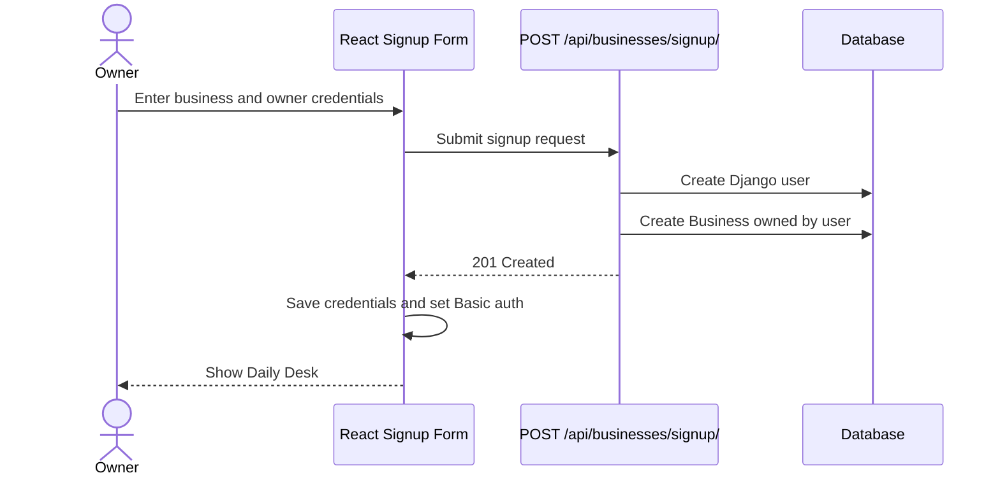
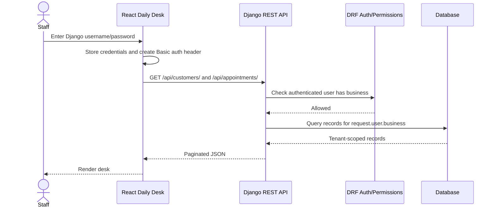
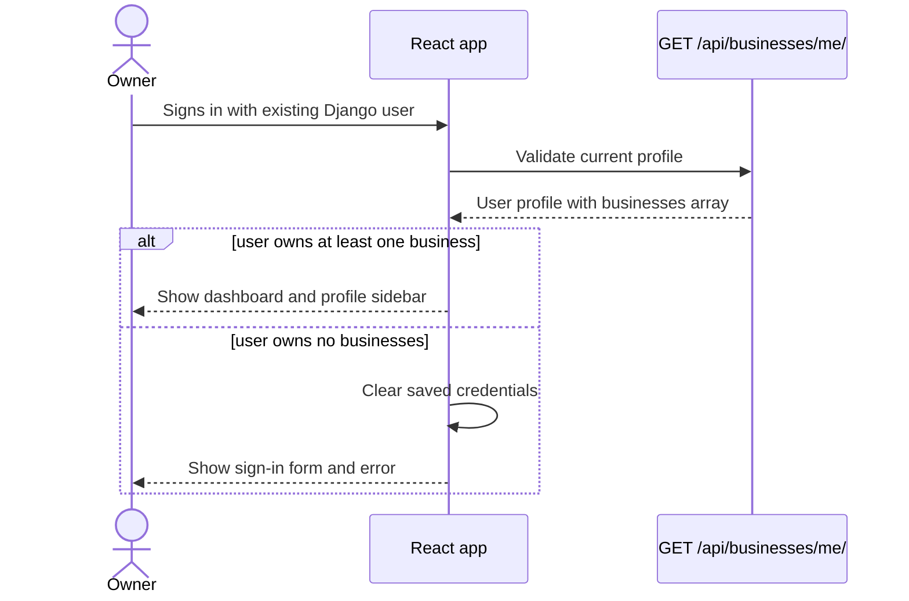
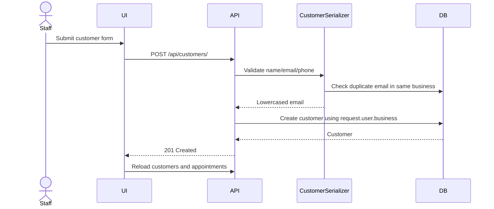
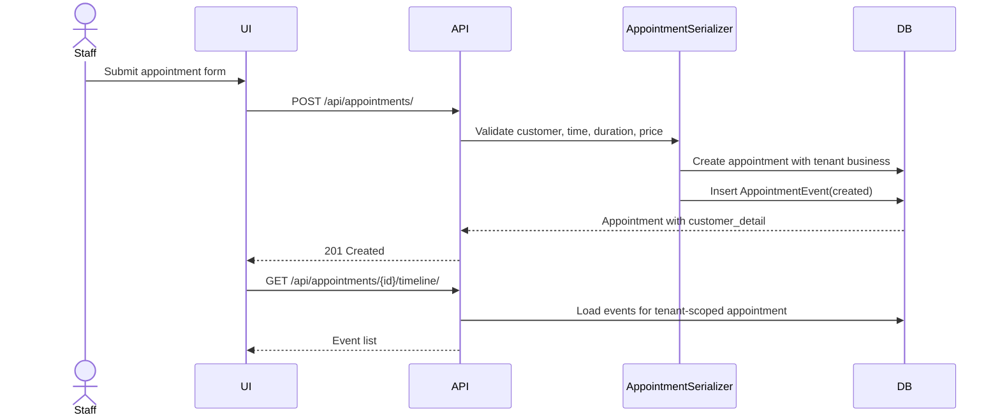
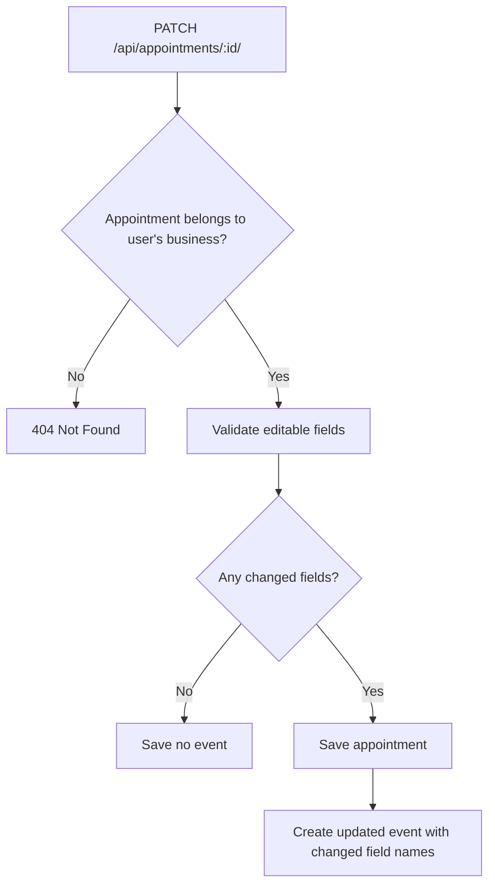
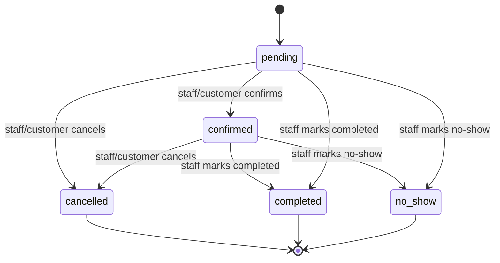
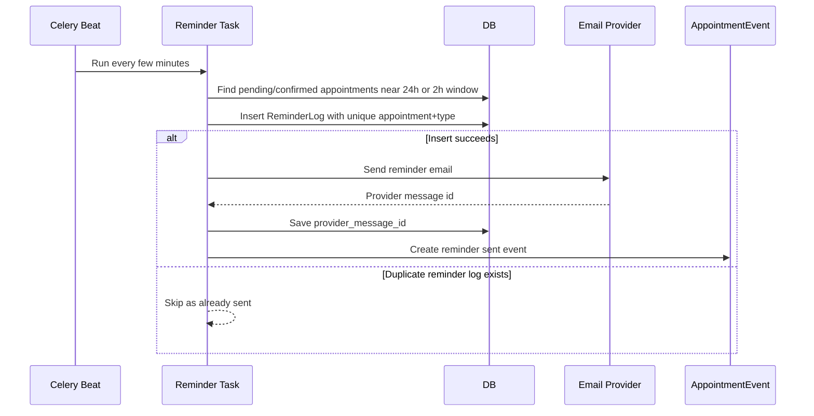
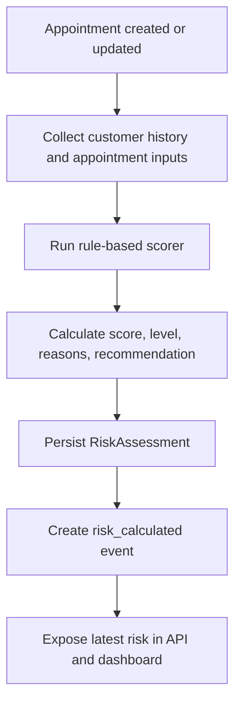

# Workflows

## Implemented: business signup



## Implemented: authenticated staff data flow



## Implemented: reject signed-in users without a business



## Implemented: customer creation



## Implemented: appointment creation and timeline



## Implemented: appointment update event



## Planned: lifecycle transition workflow



Implementation notes:

- Use explicit endpoints such as `POST /api/appointments/{id}/confirm/`.
- Wrap status update, event creation, and customer counter updates in one transaction.
- Make repeated transitions idempotent where appropriate, especially public customer actions.

## Planned: reminder workflow



## Planned: signed public action link workflow

```mermaid
sequenceDiagram
    actor Customer
    participant Link as Signed Link
    participant PublicAPI as Public Endpoint
    participant DB
    participant Events

    Customer->>Link: Click confirm or cancel
    Link->>PublicAPI: GET/POST tokenized action URL
    PublicAPI->>PublicAPI: Verify signature, appointment id, action, expiry
    alt Token valid
        PublicAPI->>DB: Transition appointment idempotently
        PublicAPI->>Events: Create confirmed/cancelled event
        PublicAPI-->>Customer: Show success page
    else Invalid or expired
        PublicAPI-->>Customer: Show invalid/expired link page
    end
```

## Planned: risk scoring workflow


